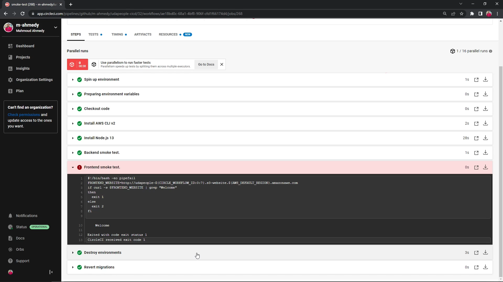

# Part 14 - Clean Up

After finishing updating the CloudFront distribution to (Blue) deployment and verifying that it is fine and stable we can now proceed to removing the old (Green) deployment and its infrastructure

## Objectives

- Remove the old stacks from the previous successful run

## Affected files

- CircleCI configuration file `.circleci/config.yml`

## Overview

The steps to perform a successful cleanup can be summarized as the following

- Get the old (Green) Workflow ID and save it in a variable for reference
- Get the list of deployed stacks in the current region, and save it also in a variable for reference
- Check that in the list of all stacks has a stack that contains the Old Workflow ID
  - If the answer is yes, then continue and empty the bucket of the frontend stack and proceed to remove both frontend and backend stacks
  - If not don't do anything

So it can be implemented like the following

```sh
# Get the current stacks in the regions that were deployed successfully
export STACKS=($(aws cloudformation list-stacks \
                --query "StackSummaries[*].StackName" \
                --stack-status-filter CREATE_COMPLETE --no-paginate --output text))
echo Stack names: "${STACKS[@]}"

# Get the Old Workflow update from KVDB.io
export OldWorkflowID=$(curl --insecure https://kvdb.io/${KVDB_BUCKET}/old_workflow_id)
echo Old Workflow ID: $OldWorkflowID

# Check if in the list of the stacks there's some stacks that has the Old Worfkflow update in their name
if [[ "${STACKS[@]}" =~ "${OldWorkflowID}" ]]
then
    # If yes empty the bucket associated with the frontend stack and delete the stacks
    aws s3 rm "s3://udapeople-${OldWorkflowID}" --recursive
    aws cloudformation delete-stack --stack-name "udapeople-backend-${OldWorkflowID}"
    aws cloudformation delete-stack --stack-name "udapeople-frontend-${OldWorkflowID}"
fi
```

## Implementation

There's no fancy configuration around here, just more of the same

`.circleci/config.yml`

```yml
jobs:
  ...
  cleanup:
    docker:
      - image: cimg/base:stable
    steps:
      - checkout
      - install_awscli
      - install_nodejs
      - run:
          name: Remove old stacks and files
          command: |
            export STACKS=($(aws cloudformation list-stacks \
                --query "StackSummaries[*].StackName" \
                --stack-status-filter CREATE_COMPLETE --no-paginate --output text))
            echo Stack names: "${STACKS[@]}"

            export OldWorkflowID=$(curl --insecure https://kvdb.io/${KVDB_BUCKET}/old_workflow_id)
            echo Old Workflow ID: $OldWorkflowID

            if [[ "${STACKS[@]}" =~ "${OldWorkflowID}" ]]
            then
              aws s3 rm "s3://udapeople-${OldWorkflowID}" --recursive
              aws cloudformation delete-stack --stack-name "udapeople-backend-${OldWorkflowID}"
              aws cloudformation delete-stack --stack-name "udapeople-frontend-${OldWorkflowID}"
            fi

workflows:
  default:
    jobs:
        ...
        - cleanup:
            requires: [cloudfront-update]
```

---

Commit and push the changes to GitHub to trigger a workflow on CircleCI

---

The workflow will trigger, and if everything is done correctly it should complete successfully

Take a screenshot of the successful clean up job [**SCREENSHOT09**]



---

Now just a simple task remains in the pipeline
